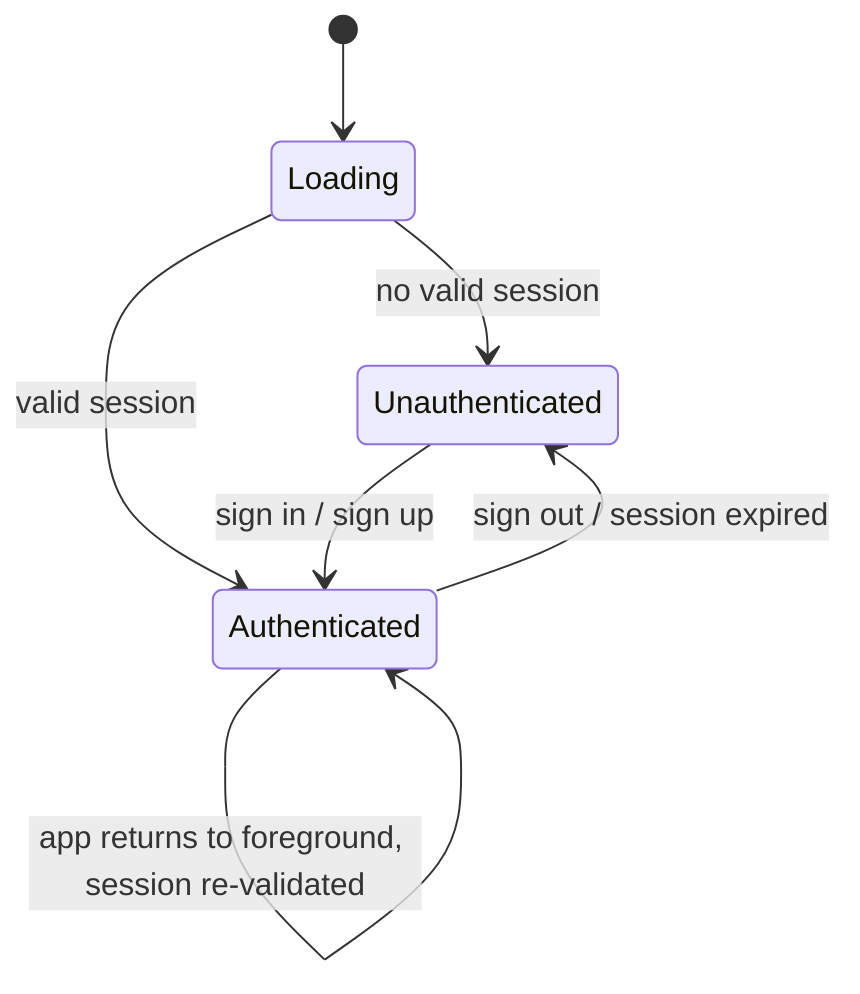
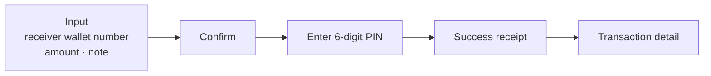
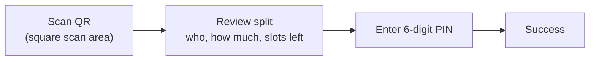
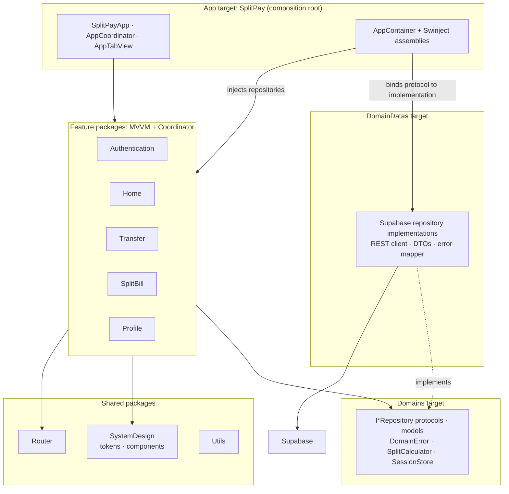
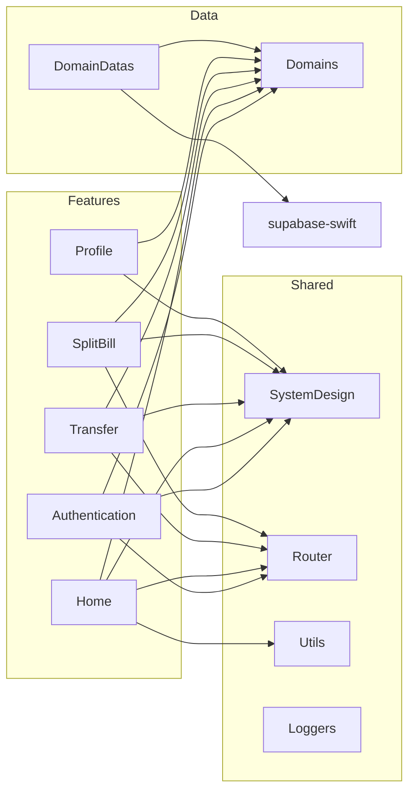
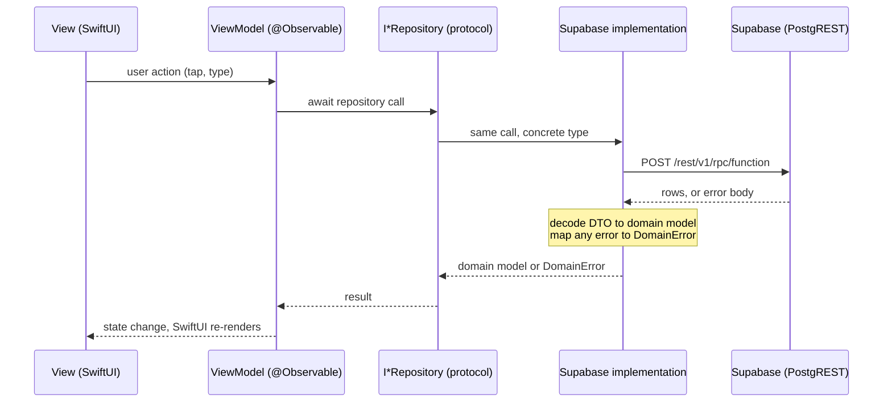
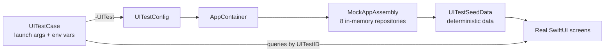

# SplitPay

**SplitPay** is an iOS banking-style wallet app. A user sends money to another
SplitPay wallet, and can then **split the cost of that transaction** among
friends: the app generates a QR code, friends scan it and pay their share, and
the requester tracks who has paid.

It is a native SwiftUI app with a Supabase (Postgres + Auth) backend, built as
a modular Swift Package project with a dedicated design system, dependency
injection, and both unit and UI test suites.

> **Reading guide.** Managers: read [Project at a glance](#1-project-at-a-glance),
> [What the app does](#2-what-the-app-does), and [Known issues and open
> decisions](#13-known-issues-and-open-decisions). Engineers: everything below
> [Tech stack](#3-tech-stack) is the architecture and working guide.

---

## Contents

1. [Project at a glance](#1-project-at-a-glance)
2. [What the app does](#2-what-the-app-does)
3. [Tech stack](#3-tech-stack)
4. [Architecture](#4-architecture)
5. [Repository layout](#5-repository-layout)
6. [Design system](#6-design-system)
7. [Business rules](#7-business-rules)
8. [Backend contract (Supabase)](#8-backend-contract-supabase)
9. [Getting started](#9-getting-started)
10. [Testing](#10-testing)
11. [Code quality and tooling](#11-code-quality-and-tooling)
12. [Project history and ownership](#12-project-history-and-ownership)
13. [Known issues and open decisions](#13-known-issues-and-open-decisions)
14. [Roadmap](#14-roadmap)
15. [Glossary](#15-glossary)

---

## 1. Project at a glance

| | |
|---|---|
| **Product** | In-app wallet: transfer money between SplitPay wallets, split a past transaction, repay a split by scanning a QR code |
| **Platform** | iOS, native. App target deploys to **iOS 26.2** |
| **Language / UI** | Swift 6.2 toolchain, SwiftUI |
| **Architecture** | Feature-modular MVVM + Coordinator, one local Swift Package per feature and per shared layer |
| **Backend** | Supabase: Postgres functions (RPC) over PostgREST, Supabase Auth |
| **Third-party code** | Only two libraries: `supabase-swift` (auth) and `Swinject` (dependency injection) |
| **Size** | 1 app target + 10 local packages, about 200 unit tests, 38 UI tests |
| **Timeline** | First commit 2026-09-07, latest 2026-09-30 (about 100 commits) |

### Status by area

| Area | Status | Notes |
|---|---|---|
| Sign in / Sign up | Working | Email + password through Supabase Auth |
| Home dashboard | Working | Balance, quick actions, 3 latest transactions, live refresh |
| Transfer (send money) | Working | Receiver lookup, PIN authorization, receipt, detail |
| Transaction history | Working | Filter, grouped by day, detail |
| Split a bill | Working | Setup, QR, edit, cancel, details, history |
| Repay by scanning QR | Working | Needs a real device camera (simulator uses a test seam) |
| Profile and PIN | Working | Set up PIN, change PIN (verifies current PIN), sign out |
| Automated tests | Working | Unit tests per package, XCUITest suite on a mock backend |
| CI/CD | Working | GitHub Actions: lint, build and tests on every change; TestFlight release when you push a version tag ([docs/ci-cd.md](docs/ci-cd.md)) |
| Backend SQL in repo | Not present | Database functions live only in Supabase (see [section 13](#13-known-issues-and-open-decisions)) |

---

## 2. What the app does

### Navigation model

After the launch animation the app shows one of three roots, decided by the
auth state:



The authenticated root is a **tab bar**: **Home**, **History**, **Split**,
**Profile**, plus a floating **Scan QR** button shown on each tab's root
screen. Sending money and scanning open as full-screen flows on top of the tabs.

### Screens and flows

**Authentication**
- *Login* and *Register*. Register validates: name and phone required, email
  format, password of at least 8 characters, matching confirmation.

**Home**
- Greeting, balance card (balance, wallet last four digits, holder name),
  **Transfer** and **Split** quick actions, and the **3 most recent
  transactions** with a *See All* link to History.
- Refreshes automatically when a transfer or repayment completes.

**Transfer** (full-screen flow from Home)



- Receiver is found by **wallet number** with a debounced lookup (400 ms). A
  green check or red mark shows the lookup result.
- Amount can be typed or picked from quick chips (500,000 / 1,000,000 /
  2,000,000 / 5,000,000 VND). If the amount is above the available balance, a
  red line says so and Continue stays disabled.
- Confirm shows receiver, amount and note; the PIN step authorizes the
  transfer; the server is the final authority on balance and PIN.

**History and transaction detail** (History tab)
- Filter **All / Transfer / Repayment**; rows grouped by day (Today,
  Yesterday, date).
- Detail shows status (a green check when completed), transaction ID,
  receiver, description and date. Bottom actions depend on the transaction:
  - not split yet and eligible: **Split Bill** opens the split setup for it
  - already linked to a split: **View Split** opens that split's details
  - always: **Back to Home**

**Split** (Split tab)
- Two tabs, **Your Split** (splits you created) and **Split Transfer** (splits
  you paid into), each with an **Active / Inactive** filter.
- *Setup*: choose 2 to 10 participants; the app shows the equal share and what
  the requester covers. **Generate QR** creates the split.
- *QR screen*: the code friends scan; save or share.
- *Details*: progress, paid participants, pending count; for the creator,
  **Get QR**, **Edit** and **Cancel Split** (cancelling makes the split
  inactive so nobody can pay it any more).

**Repay by QR** (Scan button)



**Profile** (Profile tab)
- Name, email and phone, a **Change / Set up Transaction PIN** row, and
  **Log Out** (with a confirmation pop-up).
- PIN flow reuses the PIN-entry look: new PIN then confirm it; when a PIN
  already exists, the current PIN is verified first, then the new one is
  entered and confirmed. Saving shows a success pop-up (**PIN Created** for a
  first-time setup, **PIN Updated** for a change) that closes the sheet.

---

## 3. Tech stack

| Concern | Choice | Detail |
|---|---|---|
| Language | Swift | Toolchain **6.2.3** (`.swift-version`); packages use tools version 6.2; the app target compiles in Swift 5 language mode with `MainActor` default isolation |
| UI | **SwiftUI** | No UIKit screens. One `UIViewControllerRepresentable` wraps the camera scanner |
| State | **Observation** (`@Observable`, `@MainActor`) | View models are plain observable classes; views hold them in `@State` |
| Concurrency | Swift concurrency (`async/await`, `Task`, `AsyncStream`), plus Combine in a few view models | See note below |
| Architecture | **MVVM + Coordinator** | See [section 4](#4-architecture) |
| Navigation | `NavigationStack` + a small `Router` package (`NavigationPath`) | |
| Dependency injection | **Swinject 2.10.0** | Used only in the composition root (`SplitPay/DI`) |
| Backend | **Supabase** | Postgres functions called through PostgREST RPC |
| Auth | **supabase-swift 2.55.3** | `SupabaseClient`, used only by `AuthRepository` |
| Data access | Hand-written `SupabaseRestClient` over `URLSession` | All non-auth reads and writes |
| Camera / QR | AVFoundation (`AVCaptureMetadataOutput`) | QR images are generated with Core Image |
| Design system | In-house `SystemDesign` package | Tokens, components, test IDs |
| Unit tests | **Swift Testing** (`@Test`, `#expect`) | Hand-written mocks |
| UI tests | **XCUITest** | Runs the real app against an in-memory mock backend |
| Lint / format | SwiftLint (strict) and SwiftFormat | See [section 11](#11-code-quality-and-tooling) |
| Secrets | `Secrets.xcconfig` (git-ignored) injected into `Info.plist` | |

Third-party dependencies are deliberately minimal: two direct packages, plus
their transitive dependencies (`swift-crypto`, `swift-http-types`,
`swift-asn1`, `swift-clocks`, `swift-concurrency-extras`,
`xctest-dynamic-overlay`).

Combine ships with Foundation, so it isn't a third-party dependency; it
shows up in four places: a `.debounce()` pipeline for the account lookup in
`TransferFlowViewModel`, a `NotificationCenter.publisher` bridge for the
live-refresh listener in `HomeViewModel` and `TransactionHistoryViewModel`,
a `combineLatest` pipeline for live sign-in and sign-up validation in
`LoginViewModel` and `RegisterViewModel` (each field's error shows once that
field has been edited, so the untouched form opens clean, and the submit
button only enables once the whole form is valid), and a `.map`
pipeline for the per-person preview text
in `SplitFlowViewModel`. Everywhere else, `@Observable` and Swift
concurrency handle the app's reactive needs.

---

## 4. Architecture

### 4.1 Principles

1. **Organized by feature, not by layer.** Each feature (Transfer, SplitBill,
   Home, Profile, Authentication) is its own Swift Package, so it builds and is
   tested alone.
2. **Features depend on protocols, never on the backend.** Every data source is
   an `I*Repository` protocol in `Domains`; the Supabase implementations live
   in a separate target. A feature cannot import Supabase even by accident.
3. **One place wires everything.** The app target is the composition root. It
   is the only code that knows which concrete type satisfies which protocol.
4. **Features never import each other.** Only the app target knows about
   several features at once, and it composes them.
5. **One view model per flow, not per screen.** For example one
   `TransferFlowViewModel` backs Input, Confirm, PIN and Success, so the draft
   and the result live in one place instead of being passed through every
   screen.

### 4.2 Layers



### 4.3 Inside a feature module

Every feature is shaped the same way:

```
Features/<Feature>/Sources/<Feature>/
├── View/         SwiftUI views. Layout only, no business logic
├── ViewModel/    @MainActor @Observable state + actions; one per flow
├── Coordinator/  Owns the module's navigation; builds its screens
└── (models)      Small feature-local types
```

- **View** renders state and forwards taps. It holds no business rules.
- **ViewModel** owns state, validation, and calls to repositories. It is where
  the logic (and most unit tests) live.
- **Coordinator** owns a `NavigationStack` and a `Router`, builds each screen
  and passes it only what it needs (closures for "go back", "finish", etc.).

### 4.4 Module dependency graph



`SystemDesign`, `Router`, `Utils` and `Loggers` depend on nothing in the
project. No feature depends on another feature.

### 4.5 Composition root and dependency injection

`SplitPay/DI/AppContainer.swift` builds one Swinject container from
*assemblies*, small classes that each register a group of services:

| Assembly | Registers |
|---|---|
| `SupabaseAssembly` | `SupabaseClient` (auth) with URL and key from the bundle, the `SupabaseRestClient`, and its `AccessTokenProviding` bridge |
| `DomainDataAssembly` | The 8 `I*Repository` protocols mapped to their Supabase implementations, plus `SessionStore` |
| `MockAppAssembly` (debug only) | The same protocols backed by in-memory mocks, used by UI tests |

`SplitPayApp` resolves each repository once and hands them to `AppCoordinator`.
Swinject appears **only** in this folder. Every feature receives plain
protocol-typed values through a normal initializer, so reading a feature never
requires knowing Swinject exists.

Registering a service is required before it can be resolved. A missing
registration crashes at launch with `Dependency not registered: ...`, not at
first use, so wiring mistakes are caught immediately.

### 4.6 App-level coordination

- **`AppCoordinator`** holds the root state (`loading`, `unauthenticated`,
  `authenticated`), listens to the `authStateChanges` stream from the auth
  repository, and re-validates the session whenever the app returns to the
  foreground.
- **`AppTabView`** owns the tab bar and is the only place that knows about more
  than one feature. It keeps a `Router` for the History and Split tabs so switching tabs can
  reset their stacks, and presents the full-screen flows (Transfer, Scan, Split from a
  transaction).
- A module's coordinator never talks to another module's coordinator. When
  Transfer needs "open the split for this transaction", it calls a closure; the
  app target turns that into the Split flow.

### 4.7 Data flow



### 4.8 Two Supabase clients, on purpose

| Client | Used for | Why |
|---|---|---|
| `SupabaseClient` (official SDK) | Authentication only | Session persistence, token refresh and the auth-state stream are not worth re-implementing |
| `SupabaseRestClient` (in-house, `URLSession`) | Every data call | One central place for headers, date decoding and error mapping; easy to stub |

`SupabaseRestClient` details:
- Calls `POST {SUPABASE_URL}/rest/v1/rpc/<function>` with a JSON body, plus
  simple `select` / `update` for two table reads.
- Sends `apikey` and `Authorization: Bearer <user access token>`; the server
  derives the user from the token.
- Decodes Postgres timestamps including microseconds, and Postgres `numeric`
  values that may arrive as numbers or strings (`PostgresNumeric`).
- Turns any non-2xx response body (`{message, code, details, hint}`) into a
  typed `DomainError` through `RepositoryErrorMapper`.

The access token reaches the REST client through `AccessTokenProviding`, a
small protocol wrapped around the SDK session, so the REST client never knows
who manages the session.

### 4.9 Shared state and live refresh

- **`SessionStore`** caches the available balance after it is fetched at login.
  Other modules read it and do not re-fetch. It is **for UX only** (for example
  disabling Continue early); the server re-checks the real balance on submit.
  `nil` means "unknown", which is deliberately different from zero.
- **Live refresh.** When a transfer or repayment succeeds, its view model posts
  `Notification.Name.transactionsDidChange` (defined in `Domains/AppEvents.swift`).
  `HomeViewModel`, `TransactionHistoryViewModel` and `SplitHistoryViewModel`
  listen for it and reload in place, without a spinner, so the new transaction
  appears immediately. Home also queues a reload if one arrives while another
  is running, so the last change is never dropped.

### 4.10 Error handling

- `DomainError` is the single typed error the UI sees. It has a user-facing
  `message` and conforms to `LocalizedError`, so `error.localizedDescription`
  is always readable.
- `RepositoryErrorMapper` converts server errors (matched on the error text
  such as `INVALID_PIN`, `INSUFFICIENT_BALANCE`, `SPLIT_BILL_LOCKED`) and
  network errors into cases like `.invalidPin`, `.insufficientBalance`,
  `.network`. Anything unrecognized becomes `.unknown(code:message:)`.
- Authentication has its own `AuthError` (invalid credentials, email already
  registered, weak password, rate limited, network, unknown).
- Screens show errors in the shared `AppModal` or `AlertBanner`.

### 4.11 Money

Money uses `Amount`, a wrapper around `Double`. This is a deliberate team
choice: VND has no sub-unit, so display always uses 0 fraction digits. Because
it is a `Double`, **never compare two amounts with `==` after arithmetic**;
compare with a small epsilon. The split calculator works on fractional values
internally and formats the result.

---

## 5. Repository layout

```
split-bill-app/
├── SplitPay.xcodeproj         Xcode project: the app target and the UI test target only
├── SplitPay/                  App target
│   ├── Application/           SplitPayApp (entry), AppCoordinator, config readers
│   ├── DI/                    AppContainer + assemblies (Swinject lives only here)
│   ├── Presentation/          AppTabView, launch screen
│   ├── UITestSupport/         Mock backend used by UI tests (debug only)
│   └── Config/                Debug / Release .xcconfig, Secrets.xcconfig.example
├── Features/
│   ├── Authentication/        Login, register, validators
│   ├── Home/                  Dashboard, balance card, quick actions, recent transactions
│   ├── Transfer/              Send-money flow, history, transaction detail
│   ├── SplitBill/             Split setup, QR, details, history, scan and repay
│   └── Profile/               Profile, PIN setup/change, sign out
├── Foundation/
│   ├── Domains/               Models, repository protocols, DomainError, SplitCalculator,
│   │                          SessionStore (target: Domains)
│   │                          + Supabase implementations, DTOs, REST client (target: DomainDatas)
│   ├── SystemDesign/          Design tokens and reusable components
│   ├── Router/                NavigationPath-based routing
│   ├── Utils/                 Date formatting helpers
│   └── Loggers/               Placeholder, not used yet
├── SplitPayUITests/           XCUITest suite
├── .github/workflows/         CI (ci.yml) and TestFlight release (release.yml)
├── scripts/                   run_tests.sh, run_ui_tests.sh
├── docs/                      CI/CD guide, test-suite report
├── design/                    Logo and brand assets
├── swiftgen.yml               Asset constants generation config
└── README.md                  This file
```

---

## 6. Design system

The `SystemDesign` package is the single source of truth for look and feel.
Screens use tokens and components, not raw values.

**Color tokens** (`AppColors`)

| Token | Value | Use |
|---|---|---|
| `appPrimary` | `#346699` | Brand blue: tab tint, accents, borders, links |
| `appPrimaryBold` | `#1E4D83` | Fill of the primary button |
| `appSecondary` | `#5BA8CD` | Secondary accent |
| `appSubtle` | `#C1E5E0` | Soft brand tint |
| `appBackground` | `#F8F7F3` | Screen background (warm off-white) |
| `appSurfacePrimary` | `#FFFFFF` | Cards |
| `appTextPrimary` / `Secondary` | `#1C1C1E` / `#48484A` | Text |
| `appSuccess` / `appWarning` / `appError` / `appInfo` | `#44A080` / `#DF9631` / `#D15252` / `#4A8EC5` | Status colors, each with a pale background token |

**Spacing** (`AppSpacing`): 4, 8, 12, 16, 20, 24, 32, 40, 48.
**Radius** (`AppRadius`): 8, 12, 16, 24, and full.
**Typography** (`AppTypography`): display 32 bold, title 26 bold, body 16,
bodyMedium 16 medium, label 14 semibold, caption 13.

**Components** (all in `Foundation/SystemDesign/.../Components`): `AppButton`
(primary, secondary, accent, tinted, destructive, destructive-secondary),
`BottomActionBar`, `AppNavBar`, `AppModal` with `modalOverlay`, `AlertBanner`,
`AppAlert`, `AppTextField`, `AppSecureField`, `AppIconTextField`,
`AppMultilineTextField`, `AmountField`, `QuickAmountChipRow`, `AppStepper`,
`OTPCodeInput` (PIN boxes), `NumericKeypadTray`, `Avatar`, `InfoCard`,
`DividedInfoStack`, `SettingsRow`, `StatusBadge`, `SplitRow`, `ParticipantRow`,
`PendingParticipantsRow`, `SkeletonView`, `EmptyStateView`, `QRCard`,
`QRScannerView`, progress views, and `UITestID` (accessibility identifiers for
tests).

---

## 7. Business rules

| Rule | Where |
|---|---|
| Accounts are internal SplitPay **wallet numbers**; there is no external bank concept | Domain model |
| The transaction **PIN is exactly 6 digits**; it is checked on the server | PIN screens, backend |
| **PIN lockout:** 5 consecutive wrong PINs lock verification for **10 minutes**; a successful verification (or a PIN change) resets the counter. Server raises `PIN_LOCKED` / `PIN_NOT_SET`, which the client maps to readable messages | `verify_pin`, `change_pin` (backend), `RepositoryErrorMapper` |
| A transfer, a split and a repayment each carry an **idempotency key**, so a retried request cannot create a duplicate. The database enforces this with unique indexes (`transfer_transactions`, `repayments`, `split_bills`) | Flow view models, backend |
| The client's cached balance is **never trusted**; the server re-checks balance at submit | `SessionStore`, backend |
| A split needs **2 to 10 participants** | `SplitFlowViewModel.participantRange` |
| The **requester is one of the participants** and pays no slot: with N participants there are N-1 paying slots | `SplitCalculator` |
| **Equal split:** each paying participant pays the same share (rounded to 2 decimals); the **requester absorbs the remainder**, so the parts always add up to the total. Example: 40 split 3 ways is 13.33 + 13.33 + 13.34 | `SplitCalculator.equalSplit` |
| A new split's QR **expires after 7 days** | `SplitFlowViewModel` |
| **Cancelling** a split makes it inactive; nobody can pay it through the QR after that | `SplitFlowViewModel.cancelSplit` |
| Only the **creator** can see Get QR, Edit and Cancel on a split | `SplitDetailsView` |
| A completed transfer can be split once; if it already has a split, the detail screen opens that split instead | `TransactionDetailView` |

---

## 8. Backend contract (Supabase)

The app calls **Postgres functions through PostgREST RPC**. Every call is
`POST {SUPABASE_URL}/rest/v1/rpc/<function>` with a JSON body. The SQL itself
is defined in the Supabase project, not in this repository.

Common request headers: `apikey: <anon key>`, `Content-Type: application/json`,
`Authorization: Bearer <user access token>`. Functions that return a table
always send an array, even for a single row.

### Split and repayment functions

| Function | Request body | Response |
|---|---|---|
| `create_split_bill` | `p_title, p_note, p_participant_count, p_source_transfer_id, p_idempotency_key, p_expiry_days` | `[split bill]` |
| `get_split_bills` | `p_role` (`CREATED` or `REPAID`), `p_status` (`ALL`), `p_page`, `p_page_size` | `[list item + is_requester, has_repaid, total_count]` |
| `get_split_bill_detail` | `p_split_bill_id` | `[detail + qr_payload, can_update, can_close, can_repay, is_requester, has_repaid]` |
| `update_split_bill` | `p_split_bill_id, p_title, p_note, p_participant_count, p_expires_at` (all always sent) | split bill |
| `close_split_bill` | `p_split_bill_id` (also used by *Cancel Split*) | split bill |
| `get_split_qr` | `p_split_bill_id` | `[qr code: qr_payload, is_active, expires_at, ...]` |
| `decode_split_qr` | `p_qr_payload` | `[split_bill_id, title, requester_name, total_amount, per_person_amount, required_slots, paid_slots]` |
| `create_qr_repayment` | `p_qr_payload, p_pin, p_note, p_idempotency_key` | `[repayment receipt: amount, paid_slots, split_bill_status, ...]` |

### Transfer, wallet, PIN and profile functions

| Function | Purpose |
|---|---|
| `create_transfer` | Send money (receiver, amount, description, PIN, idempotency key) |
| `get_transfer_history` | Paged history, filtered by All / Transfer / Repayment |
| `get_transfer_detail` | One transaction, including `split_bill_id`, `can_create_split_bill`, `is_split_bill_repayment` |
| `resolve_wallet_by_number` | Look up a receiver by wallet number |
| `setup_pin`, `verify_pin`, `change_pin`, `check_pin_status` | Transaction PIN management |

Two plain table reads are also used: `repayments` (paid participants of a
split) and `my_repayment_records`.

Authentication (`signIn`, `signUp`, `signOut`, session stream) goes through the
Supabase Auth SDK, not RPC. Sign-up sends `full_name` and `phone_number` as
user metadata. From the server logs, a database trigger appears to copy these
into `profiles`; that trigger is not in this repository.

---

## 9. Getting started

### Requirements

- macOS with **Xcode 26** (Swift 6.2 toolchain)
- iOS Simulator (an iPhone 17 class device or newer) or a physical device
- A Supabase project, or use the mock backend (UI tests do)
- Optional: `swiftlint`, `swiftformat` (`brew install swiftlint swiftformat`)

### Configure secrets

Real-backend builds read three values from a git-ignored file:

```bash
cp SplitPay/Config/Secrets.xcconfig.example SplitPay/Config/Secrets.xcconfig
```

Then edit it:

```
SUPABASE_URL = https:/$()/your-project.supabase.co
SUPABASE_KEY = your-publishable-key
API_BASE_URL = https:/$()/api.your-backend.com
```

(`https:/$()/` is the xcconfig way to write `https://`.) Without these the app
stops at launch with a clear `fatalError` message.

### Run

```bash
open SplitPay.xcodeproj      # choose the SplitPay scheme, then Run
```

The first build downloads the two remote Swift Packages. If Xcode shows
"Missing package product", use **File > Packages > Reset Package Caches**, then
**Resolve Package Versions**.

### Try it without a backend

Launching with the `-UITest` argument swaps the real backend for in-memory
mocks with seeded data (debug builds only). This is what the UI tests use.

---

## 10. Testing

| Suite | Framework | Count | Needs |
|---|---|---|---|
| Unit tests (per package) | Swift Testing | about 200 | Nothing for `Domains`, `Router`, `Utils`; a simulator for the rest |
| UI tests | XCUITest | 34 | Simulator; no network or account |

### Unit tests

```bash
./scripts/run_tests.sh                   # every package, PASS/FAIL summary
./scripts/run_tests.sh Transfer          # only packages matching a name
cd Foundation/Domains && swift test      # one package while iterating
```

Conventions:
- One file per subject, `XxxTests.swift`; test names are sentences, not
  `testXxx`.
- **Hand-written mocks** per package under `Tests/<Pkg>Tests/Mocks/`; they
  record call counts and last arguments.
- **Fixtures** are `makeXxx(...)` builders with default arguments.
- Formatted strings are asserted structurally, never pinned to one locale.
- The account-lookup debounce is a public constant, so tests wait on it rather
  than hardcoding 400 ms.

Not covered by unit tests on purpose: QR image rendering, the Supabase layer
over the network, and SwiftUI views (the UI tests cover those).

### UI tests

```bash
./scripts/run_ui_tests.sh                 # whole suite (about 8 minutes)
./scripts/run_ui_tests.sh TransferTests   # one class
./scripts/run_ui_tests.sh \
  -only-testing:SplitPayUITests/AuthTests/testNavigateToRegister \
  -only-testing:SplitPayUITests/ProfileTests   # several filters union
```

Run the unit and UI scripts **one at a time**; they share a simulator. Both
scripts pre-boot the simulator first; the unit script also runs each package
under a 15-minute watchdog, so a hung xcodebuild teardown fails loudly instead
of stalling forever.

How it works:



- **Mock backend:** every test launches the real app against in-memory mocks,
  so no account or network is involved and each test starts fresh.
- **Magic values** make mocks react deterministically:

  | Value | Effect |
  |---|---|
  | `fail@test.com` | sign in / sign up fails |
  | PIN `000000` | PIN verification fails |
  | wallet number `000000` | receiver lookup fails |
  | wallet number `0123456789` | resolves to the seeded receiver |
  | QR `UITEST-QR` / `UITEST-QR-FAIL` | valid repayment / decode failure |

- **Failure scenarios** (`history-fails`, `otp-fails`, `qr-decode-fails`) make
  chosen calls throw, to test error states and retries.
- **Scanner seam:** under `-UITest` the camera is replaced by a canned payload
  that still goes through the real decode path.
- **Keyboard resilience:** iOS 26 can raise a "Use Strong Password" overlay
  that swallows synthesized keystrokes; `UITestCase.type` dismisses it (the
  app also drops `.textContentType(.password)` under `-UITest`), re-checks it
  on every retry, and falls back to pasting.
- **Stable selectors:** every queried element has an identifier from
  `UITestID`; no text or coordinate queries.

| UI suite | Tests | Covers |
|---|---|---|
| `AuthTests` | 7 | Login validation and errors, login to Home, register |
| `HomeTests` | 4 | Seeded balance and profile, quick actions, See All |
| `TransferTests` | 8 | History, detail, lookup, amount chips, full transfer, over-balance guard |
| `SplitTests` | 7 | Active/inactive, detail, stepper, create to QR, repay, wrong PIN |
| `ProfileTests` | 4 | Seeded fields, PIN sheet, change PIN, log out |
| `ErrorTests` | 7 | Fetch failure and retry, empty data, PIN failure, QR decode failure |
| `SmokeTests` | 1 | App launches |

A detailed write-up of the test suite is in `docs/test-suite-confluence.md`.

---

## 11. Code quality and tooling

- **CI/CD** with GitHub Actions: every pull request is linted, built and unit-tested; pushes to `develop`/`main` also run the UI tests; pushing a tag such as `v1.0.0` uploads a build to TestFlight. See [docs/ci-cd.md](docs/ci-cd.md).
- **SwiftLint** (strict) and **SwiftFormat**; configuration in `.swiftlint.yml`
  and `.swiftformat`. Build folders and the test-support code are excluded.
- **SwiftGen** config (`swiftgen.yml`) for generated asset constants.
- **Comment style:** sparse, single-line `//` comments that explain *why*, not
  *what*.
- **Code style:** plain control flow and explicit types over clever
  abstractions, so every line can be followed.

---

## 12. Project history and ownership

- First commit **2026-09-07**; latest **2026-09-30**, about 100 commits across
  feature branches merged into `develop`.
- Feature work has been done on short-lived `feature/*` branches; `develop` is
  the integration branch.
- Module authorship (from file headers): **Transfer, SplitBill and the domain
  models** were written by Dinh Long; **Authentication, Home, Profile and the
  first version of the design system and data layer** by Co Quach.

---

## 13. Known issues and open decisions

These are listed so nothing is a surprise. None block day-to-day use.

**Needs a product decision**
1. **Split rounding rule.** The code rounds each share to **2 decimals** and
   the requester absorbs the remainder. An earlier project note describes the
   rule as "round each share to the nearest **1,000 VND**". These differ
   (for example 100,000 split 3 ways). Confirm which rule is intended; the
   change is isolated to `SplitCalculator`.

**Backend and operations**
2. **Database code is not in the repository.** All RPC functions, triggers and
   security policies live only in Supabase, so a new environment cannot be
   recreated from this repo. Exporting them as versioned SQL migrations is
   recommended. Past setup issues (function security mode and `search_path`,
   password-hashing extension visibility, a PIN check that hides the real
   error) were all server-side and looked like app bugs.
3. **Duplicate phone number on sign-up.** The sign-up trigger fails on a unique
   constraint and the user only sees "Something went wrong". The server should
   return a specific error the app can map.
4. **CI is set up, but two manual steps remain.** SwiftLint only reports (the existing code still has style warnings), and the checks are not yet *required* by branch protection. Releases also need the one-time secrets described in [docs/ci-cd.md](docs/ci-cd.md).

**Cleanup items**
5. `Core/CommonUi` was merged into `SystemDesign`, but a stray
   `Core/CommonUi/Tests/CommonUiTests/AppAlertTests.swift` and an entry in
   `scripts/run_tests.sh` still point at the removed package. The test should
   move to `SystemDesign`.
6. Unused leftovers: `PinCard`, `ProfileInfoRow`, `HomeFloatingNavigation`, a
   second `TransactionRow` in `SystemDesign`, and `[DEBUG]` prints in
   `HomeView`.
7. `Foundation/Loggers` is an empty placeholder.
8. `TransferPIN.testValue` (a test PIN) lives in production source and is only
   used by tests; it should move to the test target.
9. **Deployment target mismatch:** the app targets iOS 26.2, but the packages
   declare iOS 17 as their minimum. Decide on one supported range.
10. The app target compiles in Swift 5 language mode while the packages use
    tools version 6.2. Moving the app to Swift 6 mode is a follow-up.

---

## 14. Roadmap

- Move database functions into versioned SQL migrations in the repo
- Resolve the split rounding rule with product
- Clean up the items in section 13
- Require the CI checks with branch protection, and fix the SwiftLint warnings so lint can block a merge
- Return specific sign-up errors (duplicate phone or email) from the server
- Refresh Split lists live when a split is created or edited (currently only
  transfers and repayments trigger a live refresh)
- Biometric unlock for PIN entry
- Push notification when someone pays your split

---

## 15. Glossary

| Term | Meaning |
|---|---|
| **Wallet** | A user's SplitPay account that holds a balance; identified by a wallet number |
| **Transfer** | Sending money from your wallet to another wallet |
| **Split bill** | A record created from a past transfer that divides its cost among participants |
| **Requester** | The person who created the split and is owed money |
| **Participant / payer** | Someone who pays a share of a split |
| **Slot** | One paying share in a split; with N participants there are N-1 slots |
| **Repayment** | A participant's payment of their share, made by scanning the split's QR |
| **Per-person amount** | The equal share each paying participant owes |
| **PIN** | The 6-digit code that authorizes a transfer or repayment |
| **Composition root** | The one place in the app that decides which concrete class satisfies each protocol |
| **Repository** | A protocol-defined gateway to data; the app talks to these, never to the database directly |
| **RPC** | A call to a named Postgres function through Supabase's API |
