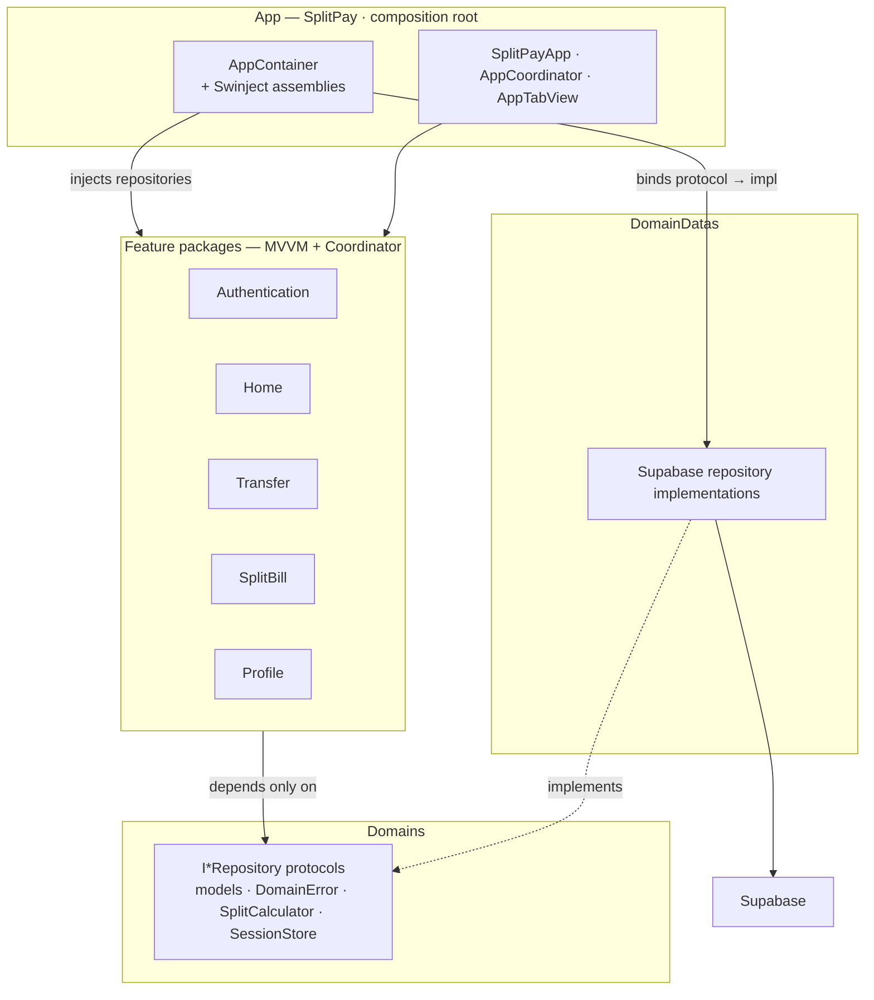
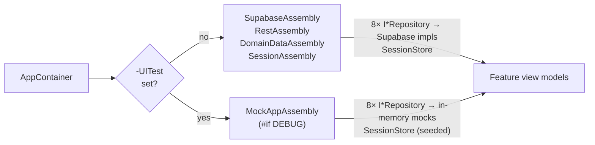
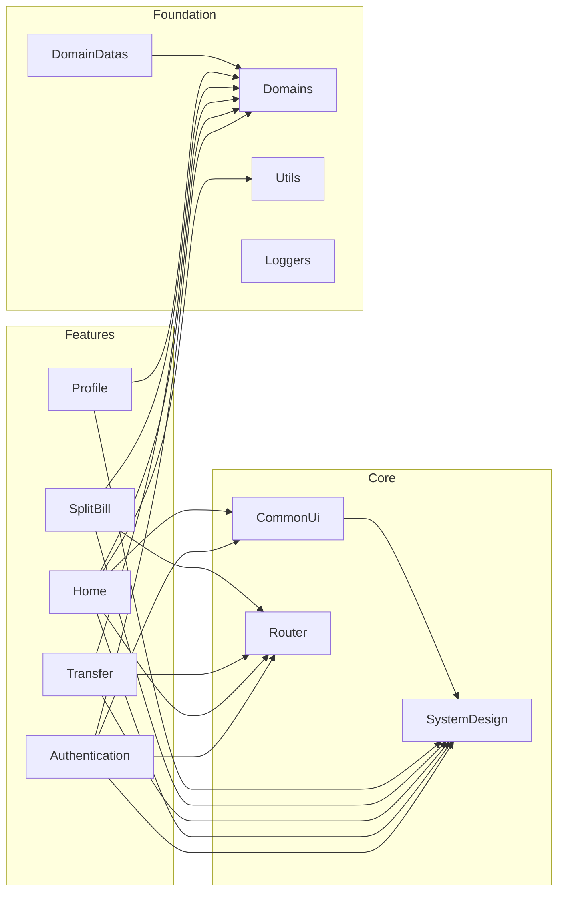
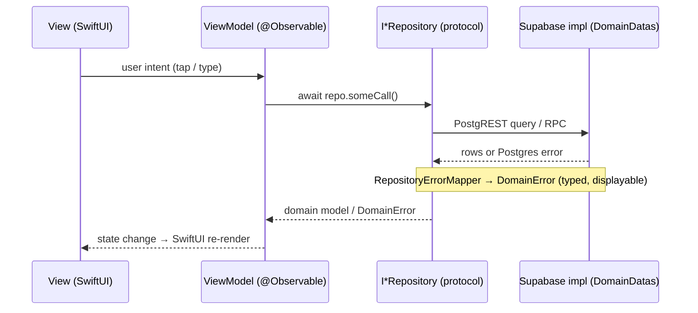
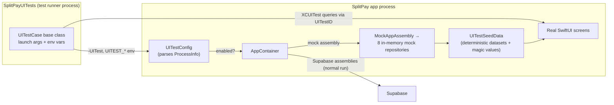

# SplitPay — split-bill-app

An iOS app for splitting bills: pick a past transfer, divide it among
participants, share a QR for everyone to repay, and track who has paid.

## Features

- **Wallet & dashboard** — balance hero card, recent transactions, quick
  actions (Transfer / Split Bill / Scan QR).
- **Transfer money** — look up a receiver by wallet number or phone
  (debounced account lookup), pick a quick amount, confirm, verify by OTP,
  and see the receipt.
- **Transaction history** — filter by Transfers / Repayments, drill into a
  transaction's detail, and turn any sent transfer into a split bill.
- **Split bills** — split an amount equally across participants with the
  requester absorbing the remainder, share a QR code, track paid slots.
- **Repay by QR** — scan a split-bill QR, review the repayment, verify by
  PIN, done. (On the simulator the scanner is injected via a test seam.)
- **Profile** — personal info, PIN setup / change, sign out.

## Tech stack

| Layer | Choice |
|---|---|
| UI | SwiftUI (iOS 17+), design-system components in `SystemDesign` |
| Architecture | MVVM + Coordinator, `@MainActor @Observable` view models |
| Navigation | `NavigationPath`-based `Router` package |
| DI | [Swinject](https://github.com/Swinject/Swinject) assemblies |
| Backend | Supabase (Postgres + Auth) via `DomainDatas` repositories |
| Money | `Amount` type — fractional dong, no `Int64` balance math |
| Errors | `DomainError` — typed, user-facing messages through `LocalizedError` |
| Tests | Swift Testing (`@Test`/`#expect`) for units, XCUITest for UI |

## Requirements

- Xcode 26+ (Swift 6.2 toolchain)
- iOS 17+ deployment target
- An iOS simulator (iPhone 17 Pro or newer) for the feature-package and UI tests

## Getting started

```bash
open SplitPay.xcodeproj     # select the SplitPay scheme, run
```

Secrets live in `Secrets.xcconfig` (Supabase URL + anon key) — see
`SplitPay/Config`. Without them the real-backend build `fatalError`s at DI
time; UI tests don't need them (they swap in the mock assembly).

## Project layout

The app is a plain Xcode project (app target: `SplitPay`) plus a set of local
SwiftPM packages — every feature and foundation layer builds and tests on its
own:

```
├── SplitPay.xcodeproj        # App target only; thin shell over the packages
├── SplitPay/                 # App entry point, DI wiring, UITestSupport
├── Core/
│   └── CommonUi/             # Shared SwiftUI pieces (AppAlert, skeletons…)
├── Foundation/
│   ├── Domains/              # Models, DomainError, SplitCalculator,
│   │                         # SessionStore, I*Repository protocols
│   │                         # (+ DomainDatas target: Supabase impls,
│   │                         #  Postgres decoding, error mapping)
│   ├── Router/               # NavigationPath-based routing
│   ├── Utils/                # Formatting helpers (DateFormatting…)
│   ├── Loggers/              # Logging
│   └── SystemDesign/         # Design system (components, theme, UITestID)
├── Features/
│   ├── Authentication/       # Login / register (validators + view models)
│   ├── Home/                 # Dashboard: profile, wallet, recent transfers
│   ├── Transfer/             # Transfer flow, history, transaction detail
│   ├── SplitBill/            # Split setup, QR flow, history, repay by scan
│   └── Profile/              # Profile, PIN setup/change, sign out
├── design/                   # Design references
├── SplitPayUITests/          # XCUITest suite (mock backend, one launch per test)
├── swiftgen.yml              # Generated asset constants (SystemDesign)
└── scripts/                  # run_tests.sh (unit), run_ui_tests.sh (UI)
```

## Architecture

### Layers



**The one rule that makes this testable:** features depend only on the
`I*Repository` protocols declared in `Domains` — never on Supabase. The
implementations live in `DomainDatas` and are wired up in the app target's
`AppContainer`, so any layer above the protocols can be tested with
hand-written mocks (and the whole app can run on in-memory mocks for UI
tests).

### Dependency injection

`AppContainer` is the **composition root** — the only place that knows which
concrete types exist. It builds one Swinject `Container` and applies
assemblies in order; view models receive their repositories through `resolve`
at coordinator construction. Wiring mistakes crash at launch
(`fatalError` on unregistered type), not at first use. All repositories are
registered `.inObjectScope(.container)` (singletons).

| Assembly | Registers |
|---|---|
| `SupabaseAssembly` | `SupabaseClient` (auth + PostgREST, credentials from `Secrets.xcconfig`) |
| `RestAssembly` | `SupabaseRestClient` + `AccessTokenProviding` (bridges the session token into REST headers) |
| `DomainDataAssembly` | the 8 `I*Repository` protocols → Supabase-backed implementations |
| `SessionAssembly` | `SessionStore` |
| `MockAppAssembly` (`#if DEBUG`) | the same 8 protocols + `SessionStore`, backed by `MockAppStore` / `UITestSeedData` |



#### Two Supabase clients — and why

The data layer deliberately talks to Supabase through **two clients**, split
by what each is good at:

- **`SupabaseClient` (official SDK) — auth only.** `AuthRepository` is its
  only consumer: sign in/up/out, the `authStateChanges` stream, session
  persistence and token refresh. Re-implementing those is not worth it.
- **`SupabaseRestClient` (hand-rolled, in `DomainDatas/Network/`) — all data
  reads/writes.** Its 7 repository consumers call `rpc`/`select`/`update`
  over `URLSession` directly, which buys: a centralized JSON decoder that
  handles Postgres `timestamptz` microseconds (`now()` carries 6 fractional
  digits; ISO8601 parses only 3), one owned choke point that turns every
  non-2xx PostgREST body into a typed `DomainError`, and an `URLSession`-
  injectable client that's easy to stub in tests — none of which the SDK's
  `PostgrestClient` surfaces cheaply.
- **The bridge:** `RestAssembly` wires `AccessTokenProviding` around
  `SupabaseClient.auth.session`, so the REST client only needs a token and
  never knows who manages the session.

`Foundation/Network` (a generic `APIClientService` HTTP layer) used to sit
alongside these and duplicate 90% of `SupabaseRestClient` — nothing imported
it, so it was deleted.

### Module dependency graph



### Request → UI data flow



### Key flows

**Transfer** — `History → Detail → Input (receiver lookup, amount, note) →
Confirm → OTP → Success`. The receiver lookup is debounced
(`TransferFlowViewModel.accountLookupDebounce`, a public constant unit tests
sleep on). Amount exceeding the available balance disables Continue and shows
an inline error.

**Split bill** — from a sent transfer's detail (or the Split tab):
`Setup (participants stepper → equal split) → QR screen → share/save`. The
`SplitCalculator` divides to fractional dong and lets the requester absorb
the remainder so the parts always add back to the total (40 / 3 → 13.33 +
13.33 + 13.34).

**Repay by QR** — `Scan QR → Review → PIN → Success`. The scanned payload is
decoded by the view model's real `decode()` path — the UI-test scanner seam
only injects the payload string, never a pre-decoded result, so error
scenarios still exercise the real code.

## Running the tests

### Unit tests (~206 tests, 10 packages)

The suite uses [Swift Testing](https://developer.apple.com/xcode/) (`@Test`,
`#expect`) throughout — there is no XCTest.

```bash
./scripts/run_tests.sh
```

This runs every package and prints a PASS/FAIL summary; it exits non-zero if
anything failed. One failing package never stops the others.

- `Foundation/{Utils,Router,Domains}` test on the macOS host
  (`swift test` — fast, no simulator needed).
- `Core/CommonUi` and the five `Features/*` packages import `SystemDesign`,
  so they test in the iOS simulator (`xcodebuild test`). The script picks the
  booted simulator, falling back to the first available iPhone.

Useful variations:

```bash
./scripts/run_tests.sh Transfer                  # only packages matching a name
SIM_DESTINATION="platform=iOS Simulator,name=iPhone 17 Pro" ./scripts/run_tests.sh

# Single package while iterating:
cd Foundation/Domains && swift test
cd Features/Transfer && xcodebuild test -scheme Transfer \
    -destination "platform=iOS Simulator,name=iPhone 17 Pro"
```

### Unit test conventions

- **One file per subject**, named `XxxTests.swift`; test names are sentences
  (`theFormIsInvalidWhenTheAmountExceedsTheBalance`), not `testXxx`.
- **Hand-written mocks per package** in `Tests/<Pkg>Tests/Mocks/` — no shared
  mock library (SPM has no dev-dependencies). Mocks are `final class …
  @unchecked Sendable`, record call counts and last arguments, and can gate a
  call behind a continuation to test reentrancy guards.
- **Fixtures** live in a per-target `Fixtures.swift` with `makeXxx(…)`
  builders using default arguments.
- **Locale-safe assertions.** Formatted strings are asserted structurally
  (sign, `"VND"` suffix, `contains`) or compared against an identically
  configured formatter — never pinned to one locale's separators. Date
  grouping uses an injected `Calendar`.
- **Debounce is testable** because `TransferFlowViewModel.accountLookupDebounce`
  is a public constant tests sleep on.

Deliberately not tested: `qrImage` (UIImage rendering), idempotency-key
rotation (private, no seam — noted in the relevant test files), the Supabase
data layer over the network, and SwiftUI views (covered by the UI tests
below).

## UI tests (XCUITest)

The unit tests above mock the repositories; `SplitPayUITests` drives the real
app on the simulator — navigation, forms, multi-screen flows.

```bash
./scripts/run_ui_tests.sh                 # whole suite (34 tests, ~8 min)
./scripts/run_ui_tests.sh TransferTests   # one class
./scripts/run_ui_tests.sh "AuthTests/testLoginSucceedsReachesHome"
```

The two scripts share the simulator — **run one at a time**, never both
concurrently (device lock).

### How it runs



- **Mock backend.** Every test launches the app with `-UITest`, which swaps
  the DI container's Supabase assemblies for in-memory mock repositories
  (`SplitPay/UITestSupport/`, all `#if DEBUG`). No account, credentials or
  network involved, and each test gets a fresh store.
- **Deterministic data.** `UITestSeedData` serves two datasets (`empty`,
  `default`) plus "magic values" the mocks react to:

  | Magic value | Effect |
  |---|---|
  | `fail@test.com` | sign in / sign up fails |
  | `000000` as PIN | `verifyPin` fails |
  | account `000000` | wallet lookup fails |
  | `0123456789` → "Trần Mai" | the lookup target for transfer tests |
  | QR `UITEST-QR` / `UITEST-QR-FAIL` | valid repay / decode-failure payloads |

  The tests and the seed data are one contract — change them together.
- **Failure injection.** `UITEST_SCENARIO` (`history-fails`, `otp-fails`,
  `qr-decode-fails`) makes individual repository calls throw, so error states
  and retry paths are tested without a real outage.
- **Scanner seam.** The repay flow needs a camera; under `-UITest` the
  scanner is replaced with a canned QR payload injected through
  `SplitBillCoordinator.Dependencies` and fed through the real decode path.
- **Identifiers.** All queried elements expose accessibility identifiers
  from `SystemDesign`'s `UITestID` registry (`login.email`, `tab.home`,
  `transfer.otp`, `error.modal.title`, …) — no fragile label or coordinate
  queries. AppModal overlays are queried by identifier (not `app.alerts`,
  which only sees system alerts).
- **One launch per test** via the `UITestCase` base class; waits use
  `waitForExistence`, never sleeps.

### Suite map

| Suite | Tests | Covers |
|---|---|---|
| `AuthTests` | 6 | Login render + empty-field validation, invalid credentials alert, login → Home, register navigation + happy path |
| `HomeTests` | 4 | Seeded balance/profile, quick actions open Transfer / Split, see-all → history |
| `TransferTests` | 8 | History + filters, row → detail → split cover, receiver lookup, amount chips, full happy path, over-balance guard |
| `SplitTests` | 7 | Active/inactive history, detail, participant stepper, create → QR, repay happy path, wrong PIN → error modal |
| `ProfileTests` | 4 | Seeded fields, PIN sheet cancel, change PIN, logout |
| `ErrorTests` | 4 | History fetch fail + retry, empty dataset, OTP failure modal + retry, QR decode failure |

Two real bugs surfaced while writing the suite (both fixed):
`Split Bill` from a Transaction Detail in the History tab presented nothing
(its `fullScreenCover` modifier lived inside an un-presented cover), and the
error modal's buttons were unreachable to XCUITest once the modal container
carried an identifier (fixed with `accessibilityElement(children: .contain)`).

## Code style

`swiftformat` + `swiftlint --strict` (config in `.swiftlint.yml`). Note the
repo has nested `.build` directories from SwiftPM, excluded via the
`"*/.build"` glob.

## Roadmap ideas

- Supabase-backed split-bill lifecycle (lock / close when all slots paid)
- Biometric unlock for PIN entry (`biometricsEnabled` is seeded but unused)
- Push notifications when a repayment lands on your bill
