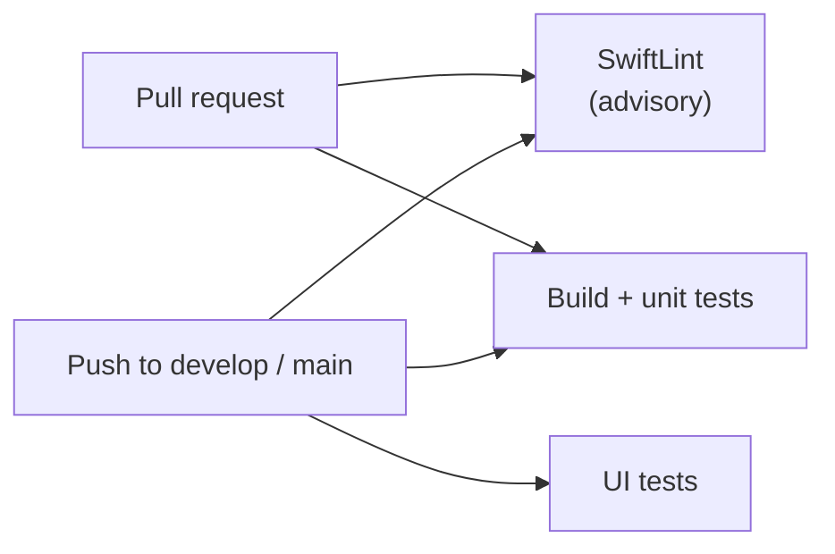

# CI/CD guide

Two GitHub Actions workflows, both in `.github/workflows/`.

| Workflow | File | Runs when | What it does |
|---|---|---|---|
| **CI** | `ci.yml` | pull request to `develop`/`main`, push to `develop`/`main`, or by hand | checks the code |
| **Release** | `release.yml` | you push a tag like `v1.0.0` | builds the app and uploads it to TestFlight |

## CI: what happens on every change



| Job | What it checks | Blocks the merge? |
|---|---|---|
| **SwiftLint** | code style | No. The existing code still has style warnings, so it only reports. Remove `continue-on-error` in `ci.yml` when they are fixed |
| **Build and unit tests** | the whole app compiles, then every package's tests run (`scripts/run_tests.sh`) | Yes (once you mark it required, see below) |
| **UI tests** | the real app is driven on a simulator against an in-memory backend (`scripts/run_ui_tests.sh`) | Not on pull requests. They only run after merge, because they take about 10 minutes |

No secrets are needed for CI. It copies `Secrets.xcconfig.example` to `Secrets.xcconfig`
(the tests use mocks, so placeholder values are fine).

### Run the same checks on your own Mac

```bash
./scripts/run_tests.sh        # unit tests of every package
./scripts/run_ui_tests.sh     # UI tests (about 8 minutes)
swiftlint                     # style (brew install swiftlint)
```

## Release: how to ship a build to TestFlight

```bash
git tag v1.0.0
git push origin v1.0.0
```

The workflow then:

1. runs the whole CI workflow (a release is never built from code that failed),
2. creates `Secrets.xcconfig` with the real server values,
3. archives the app in Release mode and signs it automatically,
4. uploads it to App Store Connect, where it appears in TestFlight after Apple finishes processing.

The version number comes from the tag (`v1.0.0` becomes `1.0.0`). The build number is the
workflow run number, so it always goes up.

### One-time setup

**1. Create an App Store Connect API key** (App Store Connect > Users and Access > Integrations > App Store Connect API).
Give it the **App Manager** role (or Admin) so Xcode may create the signing certificate by itself.
Download the `.p8` file once; Apple will not show it again. Note the **Key ID** and the **Issuer ID**.

**2. Add repository secrets** (GitHub > Settings > Secrets and variables > Actions):

| Secret | Value |
|---|---|
| `ASC_KEY_ID` | the Key ID from step 1 |
| `ASC_ISSUER_ID` | the Issuer ID from step 1 |
| `ASC_KEY_P8` | the full text of the `.p8` file, including the `BEGIN` and `END` lines |
| `SUPABASE_URL` | your Supabase project URL |
| `SUPABASE_KEY` | your Supabase publishable (anon) key |
| `API_BASE_URL` | optional; the app does not use it yet |

**3. (Recommended) Add an approval step.** Create a GitHub environment named `testflight`
(Settings > Environments) and add yourself as a required reviewer. Every release then waits for
one click before it is uploaded.

**4. Make sure the app exists in App Store Connect** with the bundle ID `com.dlong.SplitPay`.

**5. Check the team ID.** `release.yml` has `TEAM_ID: U62LXS4PHV`. Change it if your Apple team is different.

## Make the checks mandatory

GitHub > Settings > Branches > add a rule for `develop` (and `main`):

- require a pull request before merging
- require status checks to pass: select **Build and unit tests**

Then nobody can merge code that does not build or fails its tests.

## When something goes wrong

| Symptom | Likely cause and fix |
|---|---|
| `runs-on: macos-26` never starts | GitHub renamed the runner image. Check the available labels in the GitHub docs and update the three `runs-on` lines |
| "no Xcode 26" or an SDK error | the runner image does not have Xcode 26.2 yet. Update the image label, or wait for GitHub to add it |
| Build fails on `Secrets.xcconfig` | the "Create Secrets.xcconfig" step was removed or renamed |
| Archive fails with a signing or provisioning error | check the API key role (App Manager or Admin), the `TEAM_ID`, and that the bundle ID exists in App Store Connect |
| Upload says the build number was already used | push a new tag. The run number always increases, so this only happens if a run was re-run after a successful upload |
| UI tests fail only in CI | open the run, download the `ui-test-log` artifact |
